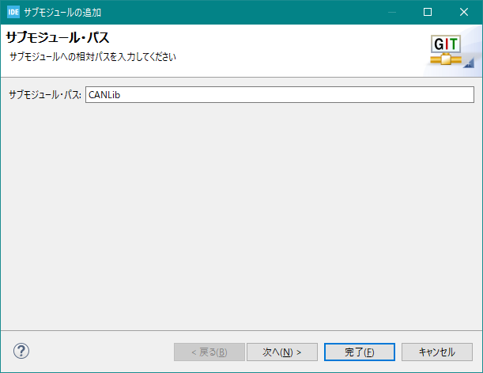
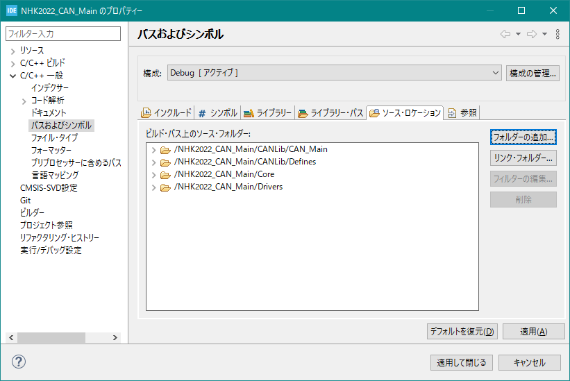
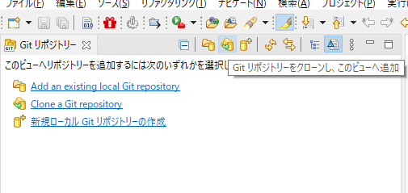

# CANLib

## 目次

- [CANLib](#canlib)
  - [目次](#目次)
  - [前提の環境](#前提の環境)
  - [プロジェクトにCANLibを導入する手順](#プロジェクトにcanlibを導入する手順)
    - [submoduleとして追加する](#submoduleとして追加する)
    - [CANLibが依存するライブラリ等](#canlibが依存するライブラリ等)
  - [このライブラリを含んだプロジェクトのクローン](#このライブラリを含んだプロジェクトのクローン)
  - [共通の仕様](#共通の仕様)
    - [実装方法](#実装方法)
    - [解説](#解説)
  - [CAN_MCMD](#can_mcmd)
    - [MCMDの状態遷移](#mcmdの状態遷移)
    - [関数](#関数)
    - [構造体](#構造体)
    - [Tips](#tips)

## 前提の環境

gitをGUIで操作する場合はSTMCubeIDEにEgitを導入し，ある程度の設定を済ませておいてください．
[参考](https://qiita.com/nabeya11/items/912fc0a9f0f02748c610)

## プロジェクトにCANLibを導入する手順

### submoduleとして追加する

すでに導入されている場合は，[このライブラリを含んだプロジェクトのクローン](#このライブラリを含んだプロジェクトのクローン)を参照してください

1. Egitパースペクティブに移る

2. プロジェクトを右クリックしてsubmoduleの追加\
   

3. サブモジュールパスに `CANLib` と入力します
   

4. ロケーションのURIにこのリポジトリ https://gitlab.com/kikaiken/canlib.git を記入，認証のところには自分のアカウントとパスワードを入力します．\
   (補足：セキュアストアに保管にチェックを入れると次回以降のアカウント入力がスキップできます)\
   

   これで完了を押します．

5. ビルドするべきファイルを選択します．\
   C/C++パースペクティブに移動し，プロジェクトのプロパティを開きます(プロジェクトを右クリック)．
   "C/C++一般"の"パスおよびシンボル"を開き，"ソースロケーション"タブで`./CANLib/Defines`と`必要なライブラリ`を追加します．\
   この画像の例では，命令を送る方（メイン基板側）のプロジェクトなので`./CANLib/CAN_Main`を追加しています．
   

   "インクルード"タブでは`CANLib/Defines/Inc`と先ほどと同じフォルダを追加します．
   

6. 5.を"適用して閉じる"すると以下のようにindexを更新するように出ますので"はい"を選択してください.
   

### CANLibが依存するライブラリ等

- pid.h/.c\
  このサイトからDLし，`Core/Inc`と`Core/Src`にそれぞれコピーする\
  https://gitlab.com/kikaiken/stmlibrary

- printf\
  printfが使えるにしておいてください．お勧めはDMA printf\
  https://gitlab.com/kikaiken/stm32-printf-dma

## このライブラリを含んだプロジェクトのクローン

Egitパースペクティブに切り替えます．


"クローン"アイコンをクリックし，以下を入力します．

1. 今開いているワークスペースまでのパス
2. プロジェクト(フォルダ)名．これはiocの名前と大文字小文字含めて同じにします
3. サブモジュールのクローンにチェックを入れる
4. プロジェクトのインポートにチェックを入れる


もし，上の操作でサブモジュールのクローンにチェックを入れ忘れた場合はEgitワークスペースにて下図のように"サブモジュールの更新"をクリックします．


## 共通の仕様

### 実装方法　

main関数内無限ループの前にCAN_SystemInit()を一度だけ実行します．引数は使用するCANのCAN_HandleTypeDefで，CubeMXで設定した場合自動で生成されます(おそらくhcan1となっている)．
CAN_SystemInit()はCANの送受信設定をしています．\
そのあと，CAN_WaitConnect();で，使用する全てのnode(基板)が起動するまで待ちます．

また，`/* USER CODE BEGIN 0 */`から`/* USER CODE END 0 */`の間に以下を記述します

```c
/* USER CODE BEGIN 0 */
void HAL_CAN_TxMailbox0CompleteCallback(CAN_HandleTypeDef* hcan){
	WhenTxMailbox0_1_2CompleteCallbackCalled();
}

void HAL_CAN_TxMailbox0AbortCallback(CAN_HandleTypeDef* hcan){
	WhenTxMailbox0_1_2AbortCallbackCalled();
}

void HAL_CAN_TxMailbox1CompleteCallback(CAN_HandleTypeDef* hcan){
	WhenTxMailbox0_1_2CompleteCallbackCalled();
}

void HAL_CAN_TxMailbox1AbortCallback(CAN_HandleTypeDef* hcan){
	WhenTxMailbox0_1_2AbortCallbackCalled();
}

void HAL_CAN_TxMailbox2CompleteCallback(CAN_HandleTypeDef* hcan){
	WhenTxMailbox0_1_2CompleteCallbackCalled();
}

void HAL_CAN_TxMailbox2AbortCallback(CAN_HandleTypeDef* hcan){
	WhenTxMailbox0_1_2AbortCallbackCalled();
}

void HAL_CAN_RxFifo0MsgPendingCallback(CAN_HandleTypeDef *hcan){
	WhenCANRxFifo0MsgPending(hcan,&num_of);
}

/* USER CODE END 0 */
```
MCMDなどの接続台数を設定するには\
main.c内に以下を記述します
```c
/* USER CODE BEGIN PV */
NUM_OF_DEVICES num_of;
/* USER CODE END PV */

/* USER CODE BEGIN 0 */
void HAL_CAN_RxFifo0MsgPendingCallback(CAN_HandleTypeDef *hcan){
	WhenCANRxFifo0MsgPending(hcan,&num_of);
}
/* USER CODE END 0 */

int main(){
  ~
  num_of.mcmd1=1;//任意の接続台数をそれぞれ指定
  num_of.mcmd2=2;
  num_of.mcmd3=5;
  num_of.servo=0;
  num_of.air=2;
  num_of.other=0;
  ~
  CAN_WaitConnect(&num_of);
  ~
}
```

### 解説
- `HAL_CAN_TxMailboxXCompleteCallback()`\
  CANの1パケット分の送信が成功した時に呼び出される割り込み
- `HAL_CAN_TxMailbox0AbortCallback()`\
  CANの1パケット分の送信が失敗した時に呼び出される割り込み
- `HAL_CAN_RxFifo0MsgPendingCallback()`\
  CANのFifo0にデータが届いたときに呼び出される割り込み

## CAN_MCMD

MCMD(マイコン付きモタドラ)を動かします

### MCMDの状態遷移


- Wait init\
  電源投入直後の状態です．
- before calibration\
  キャリブレーション(原点を探す動作)が必要な場合で，キャリブレーション動作をする前の状態を指します
- ready\
  動作する状態が可能ですが，モーターに電流は流しません．この状態ではエンコーダの値は保持し続けますこの状態で制御モードなど設定を変えることができます
- run\
  モータを制御している状態です．この状態では制御モードを変えることは出来ません．

### 関数

各関数が使用する構造体については[構造体](#構造体)参照

- MCMD_Init()\
  MCMD_HandleTypedefのうちのパラメータを送信・設定します．
- MCMD_ChangeControl()\
  送信・設定します．
- MCMD_Calib()\
  キャリブレーション（リミットスイッチ等が反応する場所を探す）を行います．
- MCMD_Control_Enable()\
  モータの制御を開始します
- MCMD_Control_Disable()\
  モータの制御を中断します
- MCMD_SetTarget()\
  モータの指令値を送信します

### 構造体
- MCMD_HandleTypedef
- MCMD_Control_Param

### Tips
MCMD_HandleTypedefの変数名をモータの機構名にするとよい\
ex.
```c
MCMD_HandleTypedef omni_fl //オムニホイールの左前(left-front)
```
